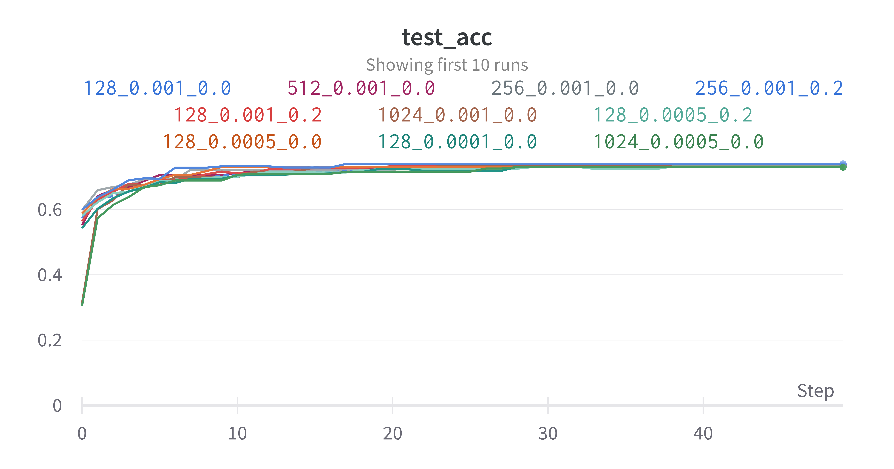
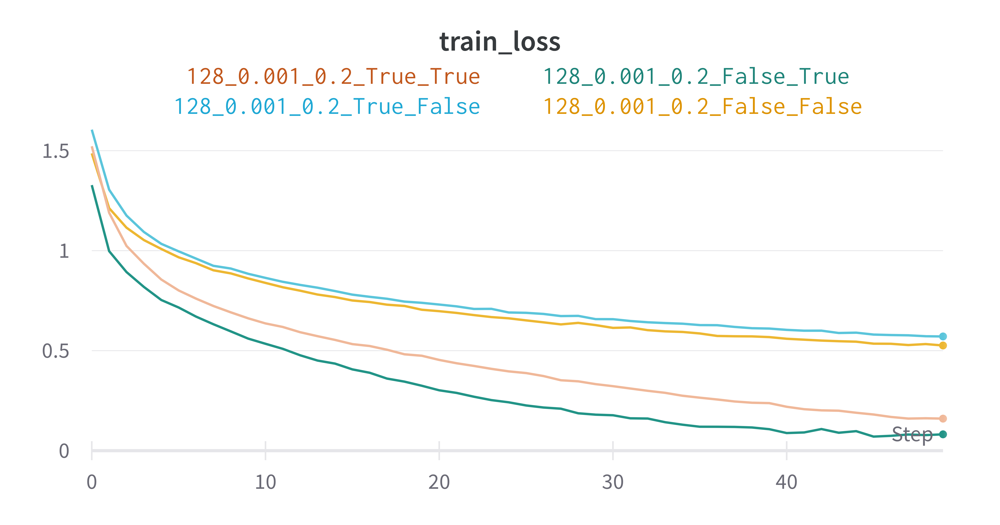
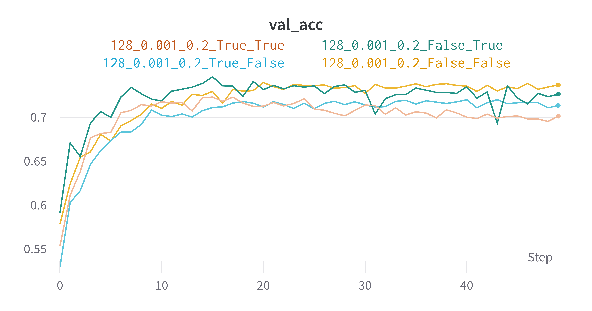
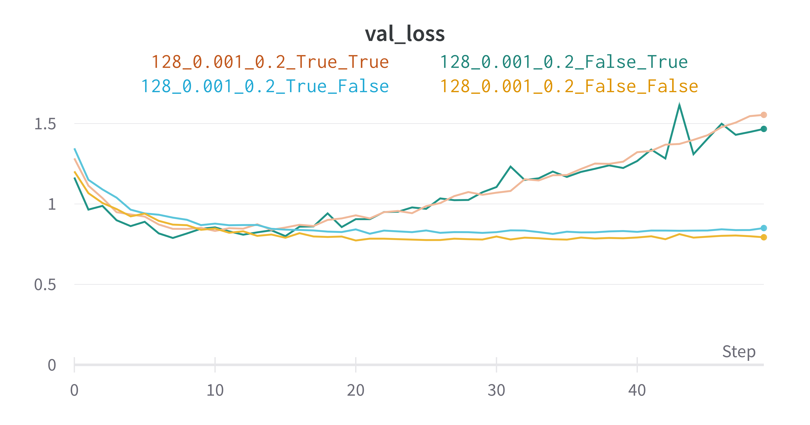

[TOC]

# ANN PA2 基础部分

赵晨阳 2020012363 计 06

## How Do  `self.training` Work

对于学习任务而言，显然训练逻辑与推理逻辑是不同。例如训练时可能会根据 loss 计算梯度，而后回传梯度，参数下降；然而做推理时，大多不需要再修改参数。又比如，`BatchNormalize` 方法需要在训练时利用累计的方法来近似全局的 `average` 和 `variance`，而推理时，这两个参数需要固定，不能再变动。因此，区分训练与否是非常重要的。

具体到 `torch` 而言，`torch.nn.Module` 以及其子类都有成员变量 `self.training`，加以显示地区分是否为训练。此外，还有两个成员函数 `self.train()` 和 `self.eval()` 作为 hook，将模型的各个部分的 `self.training` 设置为 `True / False`。

## 训练效果

### MLP

搜索的参数空间如下：

```python
    batch_sizes = [512, 1024, 2048, 4096]
    learning_rates = [0.001, 0.0005, 0.0001]
    drop_rates = [0, 0.2, 0.4, 0.6, 0.8]
```

下图按照 `val_loss` 降序排序，展示了 MLP 的整体训练效果。注意 60 个完整的实验只展示了 `val_loss` 最高的 10 条。每条曲线命名规则为 `{batch_size}_{learning_rate}_{dropout_rate}`

<div align=center>

</div>
<div align=center>MLP Training Accuracy<br/></div>

<div align=center>

</div>
<div align=center>MLP Training Loss<br/></div>

<div align=center>

</div>
<div align=center>MLP Validation Accuracy<br/></div>

<div align=center>

</div>
<div align=center>MLP Validation Loss<br/></div>

如图可见，最优的曲线为 `1024_0.001_0.2`，也即 `batch_size = 1024`，`learning_rate = 0.001`，`dropout_rate = 0.2`。

### CNN

搜索的参数空间如下：

```python
    batch_sizes = [128, 256, 512, 1024]
    learning_rates = [0.001, 0.0005, 0.0001]
    drop_rates = [0, 0.2, 0.4, 0.6, 0.8]
```

下图按照 `val_loss` 降序排序，展示了 CNN 的整体训练效果。注意 60 个完整的实验只展示了 `val_loss` 最高的 10 条。每条曲线的参数命名规则为 `{batch_size}_{learning_rate}_{dropout_rate}`

<div align=center>

</div>
<div align=center>CNN Training Accuracy<br/></div>

<div align=center>

</div>
<div align=center>CNN Training Loss<br/></div>

<div align=center>

</div>
<div align=center>CNN Validation Accuracy<br/></div>

<div align=center>

</div>
<div align=center>CNN Validation Loss<br/></div>

如图可见，最优的曲线为 `128_0.001_0.2`，也即 `batch_size = 128`，`learning_rate = 0.001`，`dropout_rate = 0.2`。

## Train 与 Validation 的区别

参考上图，模型进入平台期后，⼤多数情况下 train loss 总是显著低于 validation loss；甚至到了末期，部分未加归一化的模型会出现严重的过拟合现象，validation loss 反而上升。

train loss 与 validation loss 的区别主要有如下原因：

1. 训练集与验证集的分布有所偏差，对于训练集较好的拟合在验证集上可能效果降低。
2. 在训练后期，不加以正则化的模型容易陷入过拟合状态，模型的泛化性降低，在验证集上表现不佳。

基于对 train loss 和 validation loss 的同时检测，能够有效地帮助我们调整超参数。譬如假设出现了非常明显的过拟合现象，一来可以及时切断训练，二来可以提高 weight decay 等惩罚参数，降低 epoch 数目和 learning rate，寻求模型更好的驻点。

## 模型对比

<div align=center>

</div>
<div align=center>CNN Test Loss<br/></div>

<div align=center>

</div>
<div align=center>CNN Test Accuracy<br/></div>

<div align=center>

</div>
<div align=center>MLP Test Loss<br/></div>

<div align=center>

</div>
<div align=center>MLP Test Accuracy<br/></div>

在 test set 上，CNN 最高 `test_acc` 为 0.7397，最低  `test_loss` 为 0.7902；MLP 最高 `test_acc` 为 0.524，最低 `test_loss` 为 1.367；由此见得，CNN 显著优于 MLP。

不考虑视觉的先验经验时， CNN 仅仅是共享了参数的 MLP，计算复杂度更高，而参数更少，相对而言表达力似乎更低。然而，在视觉相关问题上，CNN 有着强大的视觉先验经验。在视觉任务上的效果远超 MLP。

实际上，CNN 模型模拟了人类的视觉直觉；人眼对于图像的理解便是从微观到全局，从高频到低频，且全过程保持着二维（乃至三维）信息的传导。通过从 low-level 到 high-level 的 feature 传递，CNN 高度利用了人眼对于图像的理解机制，可以充分利用图像上相近像素间的关系，而像素间的相互关系在 self attention 当中有着更深入的展现。MLP 将高维的图像展开为一维，导致其显式丢失了图像高维的相互信息。此外，CNN 模型通过参数共享和 pooling 机制，使其具有一定的平移不变性，也提高了 CNN 在视觉任务上的泛化能力。

总归，模型的表现有模型的容量和任务适应性共同决定。在视觉任务上，CNN 惊艳的效果众所周知，在本次实验中训练效果强于 MLP 不足为奇。

# ANN PA2 深入讨论

为了探讨 Dropout（默认为 Dropout2d） 和 batch normalization 的意义，我分别控制 CNN 与 MLP 的参数为 128_0.001_0.2 与 1024_0.001_0.2，尝试两组对比实验：

1. 同时带有 batch normalization 和 Dropout
2. 仅有 Dropout
3. 仅有 batch normalization
4. 同时关闭 batch normalization 和 Dropout

每条曲线参数命名规则为 `{batch_size}_{learning_rate}_{drop_rate}_{without_BatchNorm}_{without_dropout}`

注意，如果不使用 BatchNorm，则参数第四项将为 True，使用了 BatchNorm 第四项则为 False，Dropout 同理。此外，以 128 开头的实验是 CNN 模型的 ablation study，而 1024 开头的实验为 MLP 模型的 ablation study。

<div align=center>

</div>
<div align=center>MLP Ablation Training Accuracy<br/></div>

<div align=center>

</div>
<div align=center>MLP Ablation Training Loss<br/></div>

<div align=center>

</div>
<div align=center>MLP Ablation Validation Accuracy<br/></div>

<div align=center>

</div>
<div align=center>MLP Ablation Validation Loss<br/></div>

<div align=center>

</div>
<div align=center>CNN Ablation Training Accuracy<br/></div>

<div align=center>

</div>
<div align=center>CNN Ablation Training Loss<br/></div>

<div align=center>

</div>
<div align=center>CNN Ablation Validation Accuracy<br/></div>

<div align=center>

</div>
<div align=center>CNN Ablation Validation Loss<br/></div>

## Dropout

对于上图所示的 CNN 而言，加入 Dropout 后，模型在 validation 上的表现均优于没有加入 Dropout 的对应模型。而考虑到在 train 上，没有加入 Dropout 的模型相较加入了 Dropout 的模型有着显著的优势。可以见得，Dropout 正则化方法有效地提升了模型的泛化能力，显著减弱了过拟合现象。

BatchNormalize，Weight Decay，Bagging，Dropout 都是深度学习中非常主流的正则化方法。为了讨论 Dropout 的优劣，有必要先讨论与 Dropout 有着高度相关性的 Bagging 方法。

### Bagging 与集成方法

**Bagging** 是通过结合几个模型降低泛化误差的技术。主要想法是分别训练几个不同的模型，然后让所有模型表决测试样例的输出。这是机器学习中常规策略的一个例子，被称为模型平均。采用这种策略的技术被称为集成方法。

模型平均奏效的原因是不同的模型通常不会在测试集上产生完全相同的误差。假设我们有 $k$ 个回归模型。假设每个模型在每个例子上的误差是 $\epsilon_i$，这个误差服从零均值方差为 $\mathbb{E}\left[\epsilon_i^2\right]=v$ 且协方差为 $\mathbb{E}\left[\epsilon_i \epsilon_j\right]=c$ 的多维正态分布。通过所有集成模型的平均预测所得误差是 $\frac{1}{k} \sum_i \epsilon_i$ 。集成预测器平方误差的期望是：
$$
\begin{aligned}
\mathbb{E}\left[\left(\frac{1}{k} \sum_i \epsilon_i\right)^2\right] &=\frac{1}{k^2} \mathbb{E}\left[\sum_i\left(\epsilon_i^2+\sum_{j \neq i} \epsilon_i \epsilon_j\right)\right] \\
&=\frac{1}{k} v+\frac{k-1}{k} c
\end{aligned}
$$
在误差完全相关即 $c=v$ 的情况下，均方误差减少到 $v$，所以模型平均没有任何帮助。但是，在错误完全不相关，即 $c=0$ 的情况下，该集成平方误差的期望仅为 $\frac{1}{k} v$​ 。这意味着集成平方误差的期望会随着集成规模增大而线性减小。换言之，集成至少与它的任何成员表现得一样好，并且如果成员的误差是独立的，集成将显著地比其成员表现得更好。

不同的集成方法以不同的方式构建集成模型。而 Bagging 方法为将数据集进行独立随机采样，而重复多次使用同一种模型、训练算法和目标函数。具体来说，Bagging 涉及构造 *k* 个不同的数据集。每个数据集从原始数据集中重复采样构成，和原始数据集具有相同数量的样例。这意味着，每个数据集以高概率缺少一些来自原始数据集的例子，彼此间还包含若干重复的例子。模型 *i* 在数据集 *i* 上训练。每个数据集所含样本的差异导致了训练模型之间的差异。

神经网络中随机初始化的差异、小批量的随机选择、超参数的差异或不同输出的非确定性实现往往足以使得集成中的不同成员具有部分独立的误差，进而多个神经网络能找到足够多的不同的解；这意味着即使所有模型都在同一数据集上训练，他们也可以从模型平均中受益。

### Dropout

Bagging 涉及训练多个模型，并在每个测试样本上评估多个模型。当每个模型都是一个很大的神经网络时，这似乎是不切实际的，因为训练和评估这样的网络需要花费很多运行时间和内存。

而 **Dropout** 提供了正则化一大类模型的方法，计算方便但功能强大。Dropout 可以被认为是集成大量深层神经网络的实用 Bagging 方法。Dropout 提供了一种廉价的 Bagging 集成近似，能够训练和评估指数级数量的神经网络。

具体而言，Dropout 训练的集成包括所有从基础网络除去非输出单元后形成的子网络。在训练中使用 Dropout 时，我们会使用基于小批量产生较小步长的学习算法，每次在小批量中加载一个样本，然后随机抽样应用于网络中所有输入和隐藏单元的不同二值掩码。对于每个单元，掩码是独立采样的。掩码值为 1 的采样概率（导致包含一个单元）是训练开始前一个固定的超参数。它不是模型当前参数值或输入样本的函数。然后，我们运行和之前一样的前向传播、反向传播以及学习更新。

### Dropout 与 Bagging

Dropout 训练与 Bagging 训练不太一样。在 Bagging 的情况下，所有模型都是独立；在 Dropout 的情况下，所有模型共享参数，其中每个模型继承父神经网络参数的不同子集。参数共享使得在有限可用的内存下表示指数级数量的模型变得可能。在 Bagging 的情况下，每一个模型在其相应训练集上训练到收敛。在 Dropout 的情况下，通常大部分模型都没有显式地被训练，因为通常父神经网络会很大，以致于到宇宙毁灭都不可能采样完所有的子网络。取而代之的是，在单个步骤中我们训练一小部分的子网络，参数共享会使得剩余的子网络也能有好的参数设定。除了这些，Dropout与Bagging算法一样。例如，每个子网络中遇到的训练集也确实是有放回采样的原始训练集的一个子集。

### Dropout 的优劣

相关领域的研究已经证明，Dropout 比其他标准的计算开销小的正则化方法（如权重衰减、过滤器范数约束重投影）更有效。Dropout 也可以与其他形式的正则化合并，得到进一步的提升。

计算方便是 Dropout 的另一个优点。Dropout的另一个显著优点是不怎么限制适用的模型或训练过程。几乎在所有使用分布式表示且可以用随机梯度下降训练的模型上都表现很好。与之相比，许多效果差不多的其他正则化策略对模型结构的限制更严格。

虽然 Dropout 在特定模型上每一步的代价是微不足道的，但在一个完整的系统上使用 Dropout 的代价可能非常显著。因为 Dropout 是一个正则化技术，它减少了模型的有效容量。为了抵消这种影响，我们必须增大模型规模。不出意外的话，使用 Dropout 时最佳验证集的误差会低很多，但这是以更大的模型和更多训练算法的迭代次数为代价换来的。对于非常大的数据集，正则化带来的泛化误差减少得很小。在这些情况下，使用 Dropout 和更大模型的计算代价可能超过正则化带来的好处。然而，只有极少的训练样本可用时，Dropout 也不会很有效。

此外，随机性对实现 Dropout 的正则化效果不是必要的，同时也不是充分的。实际上，使用 Bagging 解释 Dropout 比使用稳健性噪声解释 Dropout 更好。只有当随机抽样的集成成员相互独立地训练好后，Dropout 才能达到 Bagging 集成的正则化效果。

Dropout 启发其他以随机方法训练指数量级的共享权重的集成。目前为止，其仍然是最广泛使用的隐式集成方法。

除了 Dropout 是一种纯粹高效近似 Bagging 的方法外，还有更加深刻的观点。Dropout 不仅仅是训练一个 Bagging 的集成模型，还是共享隐藏单元的集成模型。这意味着无论其他隐藏单元是否在模型中，隐藏单元必须准备好进行模型之间的交换和互换，故而每个隐藏单元必须都能够表现良好。这可以从生物学得到启发。类比有性繁殖，两个不同生物体之间交换基因，进化产生的压力使得基因不仅是良好的而且要准备好不同有机体之间的交换。这样的基因对环境的变化是非常稳健的，因为它们一定会正确适应任何一个有机体或模型不寻常的特性。因此 Dropout 正则化要求每个隐藏单元在许多情况下都表现良好。的确如此，相比独立模型集成获得泛化误差改进，Dropout 会带来额外的改进。

最后，Dropout 强大的部分原因还来自施加到隐藏单元的掩码噪声；掩码噪声可以看作是对输入内容的信息的自适应破坏，而不是对输入原始值的破坏，模型依然能够充分利用该迄今获得的关于输入分布的所有知识。

### 实验本身

基于上述讨论，回到本次实验上，Dropout 对于 MLP 和 CNN 提高泛化性都有着显著的提升。具体而言，由于训练轮次有限，带有 Dropout 之后的模型相对不带 Dropout 的模型，训练难度更高，在 training set 上的表现均有显著不足，然而泛化能力得到了高度提升。在 validation set 上，带有 Dropout 的 MLP 和不带 Dropout 的 MLP 相差无几；而带有 Dropout 的 CNN 在 validation set 上超过了不带 Dropout 的 CNN。

可以见得，无论是 MLP 这类简单模型，还是 CNN 这类更复杂的模型，Dropout 对于提升模型泛化能力都不可或缺。

## BatchNorm

BatchNorm 同样也有归一化的效果，加入 BatchNorm 后，模型在 validation 上的表现均优于或接近没有加入 BatchNorm 的对应模型。而考虑到在 train 上，没有加入 BatchNorm 的模型相交加入了 BatchNorm 的模型有着显著的优势。可以见得，BatchNorm 正则化方法有效地提升了模型的泛化能力，显著减弱了过拟合现象。

我们进一步讨论 BatchNorm 的正则化效果。

批标准化是优化深度神经网络中最激动人心的最新创新之一。实际上它并不是一个优化算法，而是一个自适应的重参数化的方法，试图解决训练非常深的模型的困难。

非常深的模型会涉及多个函数或层组合。在其他层不改变的假设下，梯度用于如何更新每一个参数。在实践中，我们同时更新所有层。当我们进行更新时，可能会发生一些意想不到的结果，这是因为许多组合在一起的函数同时改变时，计算更新的假设是其他函数保持不变。然而，我们很难选择一个共享的合适学习率，因为某一层中参数更新的效果很大程度上取决于其他所有层。即便采用了二阶优化算法，通过考虑二阶相互影响来解决这个问题，在非常深的网络中，更高阶的相互影响也会很显著。即使是二阶优化算法，计算代价也很高，并且通常需要大量近似，以免真正计算所有的重要二阶相互作用。此对于 *n >* 2 的情况，建立 *n* 阶优化算法似乎是无望的。

为了解决这一问题，批标准化提出了一种几乎可以重参数化所有深度网络的优雅方法。为了标准化 **H**，我们将其替换为：
$$
\boldsymbol{H}^{\prime}=\frac{\boldsymbol{H}-\boldsymbol{\mu}}{\sigma}
$$
其中 $\boldsymbol{\mu}$ 是包含每个单元均值的向量，$\boldsymbol{\sigma}$ 是包含每个单元标准差的向量。此处的算术是基于广播向量 $\boldsymbol{\mu}$ 和向量 $\boldsymbol{\sigma}$ 应用于矩阵 $\boldsymbol{H}$ 的每一行。在每一行内，运算是逐元素的，因此 $H_{i, j}$ 标准化为减去 $\mu_j$ 再除以 $\sigma_j$ 。网络的其余部分操作 $\boldsymbol{H}^{\prime}$ 的方式和原网络操作 $\boldsymbol{H}$ 的方式一样。在训练阶段：
$$
\boldsymbol{\mu}=\frac{1}{m} \sum_i \boldsymbol{H}_{i}\\
\boldsymbol{\sigma}=\sqrt{\delta+\frac{1}{m} \sum_i(\boldsymbol{H}-\boldsymbol{\mu})_i^2}
$$
其中 $\delta$ 是个很小的正值，比如 $10^{-8}$，以强制避免遇到 $\sqrt{z}$ 的梯度在 $z=0$ 处末定义的问题。至关重要的是，我们反向传播这些操作，来计算均值和标准差，并应用它们于标准化 $\boldsymbol{H}$ 。这意味着，梯度不会再简单地增加 $h_i$ 的标准差或均值；标准化操作会除掉这一操作的影响，归零其在梯度中的元素。这是批标准化方法的一个重大创新。 

以前的方法添加代价函数的征罚，以鼓励单元标准化激活统计量，或是在每个梯度下降步骤之后重新标准化单元统计量。前者通常会导致不完全的标准化，而后者通常会显著地消耗时间，因为学习算法会反复改变均值和方差而标准化步骤会反复抵消这种变化。批标准化重参数化模型，以使一些单元总是被定义标准化，巧妙地回避了这两个问题。

在测试阶段，$\boldsymbol{\mu}$ 和 $\boldsymbol{\sigma}$ 可以被替换为训练阶段收集的运行均值。这使得模型可以对单一样本评估，而无需使用定义于整个小批量的 $\boldsymbol{\mu}$ 和 $\boldsymbol{\sigma}$，这也是具体代码实现的 `register_buffer` 方法。

批标准化仅标准化每个单元的均值和方差，以稳定化学习，但允许单元和单个单元的非线性统计量之间的关系发生变化，总体上显著降低了模型各层的学习难度。

回到此次实验中，我们可以见得，加入 BatchNorm 正则化方法后，有效地提升了模型的泛化能力，减弱了过拟合现象。

# Bonus

## Dropout1d vs Dropout2d

如图所示，以 CNN batch_size = 128 learning_rate = 0.001 为基础模型，分别设置 Dropout_rate = {0, 0.2, 0.4, 0.6, 0.8}，对比 dropout1d 与 dropout2d。所得结果如下图：

<div align=center>

</div>
<div align=center>1d Dropout vs 2d Dropout Training Accuracy<br/></div>

<div align=center>

</div>
<div align=center>1d Dropout vs 2d Dropout Training Loss<br/></div>

<div align=center>

</div>
<div align=center>1d Dropout vs 2d Dropout Validation Accuracy<br/></div>

<div align=center>

</div>
<div align=center>1d Dropout vs 2d Dropout Validation Loss<br/></div>

总体上，当 CNN 层数并不多时，Dropout1d 略微逊色于 Dropout2d；根据先验经验， 当 CNN 层数足够多，过拟合概率足够大时，Dropout1d 的效果会显著逊色于 Dropout2d。个人认为，这一现象的原因可以归结为 Dropout1d 会把一个 feature map 视为整体，每次决定整个 feature map 的取舍。放弃某一 feature map 时，模型会丧失整个 feature map 的全部特征；而使用 Dropout2d 尚且能够根据 feature map 残留的特征进行推理。整个 feature map 的丢失加大了训练难度，使得模型容易欠拟合，正如在 Dropout 的优劣一节的讨论——

> 但在一个完整的系统上使用 Dropout 的代价可能非常显著。因为 Dropout 是一个正则化技术，它减少了模型的有效容量。为了抵消这种影响，我们必须增大模型规模。不出意外的话，使用 Dropout 时最佳验证集的误差会低很多，但这是以更大的模型和更多训练算法的迭代次数为代价换来的。

过于强硬的 Dropout1d 策略导致模型的训练难度显著上升，这需要更大的模型和更的迭代次数；在相同的迭代次数下，Dropout1d 的效果不敌 Dropout2d 可以预期。而在本次较为简单的双层 CNN 下，Dropout1d 的效果与 Dropout2d 相近也能够接受。

## Drop Rate

以 CNN batch_size = 128 learning_rate = 0.001 为基础模型，设置 Dropout_rate = {0, 0.2, 0.4, 0.6, 0.8} 且采用 Dropout2d，得到的结果如下图所示：

<div align=center>

</div>
<div align=center>Droput Rate Based On CNN Training Accuracy<br/></div>

<div align=center>

</div>
<div align=center>Droput Rate Based On CNN Training Loss<br/></div>

<div align=center>

</div>
<div align=center>Droput Rate Based On CNN Validation Accuracy<br/></div>

<div align=center>

</div>
<div align=center>Droput Rate Based On CNN Validation Loss<br/></div>

可以发觉，随着 Dropout Rate 的增大，training set 上模型的表单调递减。这非常符合前文的讨论，毕竟 dropout 机制的计入会导致模型的训练难度上升，在相同的训练轮次内，难以充分利用数据特征，表现力会有所下降。

而在 validation set 上，模型的表现能力在 Dropout Rate = 0.2 时达到了顶峰，随后快速下降。可以见得，在 Dropout Rate 大小合理时，Dropout 机制能够发挥良好的作用，虽然适度增大了模型的训练难度，然而可以显著缓和过拟合。Dropout Rate 过高时，模型在训练阶段的难度过大，训练不稳定，难以收敛，相同迭代次数内，模型的训练效果遭受了很大的打击。

总而言之，作为重要的超参数，Dropout 需要在训练难度和正则化效果当中进行取舍，需要找到合适的范围才可有利于模型的泛化能力。

## Batch Size

以 MLP learning_rate = 0.001 dropout_rate = 0.0 为基础模型，设置 batch_size = {512, 1024, 2048, 4096}，得到的结果如下图所示：

<div align=center>

</div>
<div align=center>Batch Size Based On MLP Training Accuracy<br/></div>

<div align=center>

</div>
<div align=center>Batch Size Based On MLP Training Loss<br/></div>

<div align=center>

</div>
<div align=center>Batch Size Based On MLP Validation Accuracy<br/></div>

<div align=center>

</div>
<div align=center>Batch Size Based On MLP Validation Loss<br/></div>

在 training set 上，训练效果随着 batch_size 增大而单调降低，而在 validation set 上，训练效果随着 batch_size 先增后减。

对于 batch normalization 而言，增大 batch size 的好处显而易见，毕竟更大的 batch size 能够让每个 batch 内缓存的 average 和 variance 更加接近全局信息，有利于模型的稳定。倘若 validation set 与 training set 的 domain shift 不太显著，更全局的 average 和 variance 也有利于模型在推理过程的表现。

batch size 越大，批次越少，训练时间会更快一点，但可能造成数据的大量浪费，且较大的全局梯度信息容易让模型陷入局部鞍点；而 batch size 越小，能够引入更多随机噪声，对数据的利用越充分，浪费的数据量越少，但批次较大，训练会更耗时。

综上所述，batch size 需要具体问题具体分析，不能单纯考虑对 batch normalization 的加成而一味加大 batch size。
